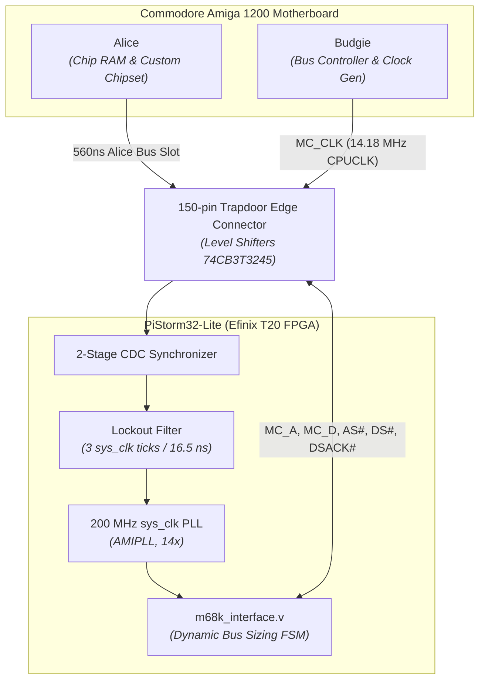
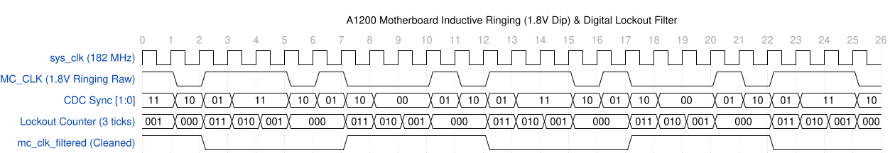

# Amiga 1200 Bus & Clock Timing

This document covers the Amiga 1200 CPU bus architecture, clocking quirks, the E121/E122 ringing issue, dynamic bus sizing, and throughput measurements.

---

## 1. Motherboard Clock Architecture

The Amiga 1200 motherboard generates clocks from a single master crystal:
- **PAL:** 28.37516 MHz
- **NTSC:** 28.63636 MHz

The Budgie gate array divides this to produce the primary system clocks:
- **`CPUCLK` (`MC_CLK`):** 14.18758 MHz PAL / 14.31818 MHz NTSC (approx. 70.5 ns period). This clock is routed to Pin 87 of the 150-pin trapdoor expansion connector.
- **`CCK` (Colour Clock):** 7.09379 MHz (approx. 140.9 ns period), used internally by Alice and the custom chips.
- **`CLK90`:** 7.09 MHz quadrature clock shifted 90 degrees for DRAM and chipset timing.



---

## 2. The E121/E122 Clock Ringing Issue

On several motherboard revisions (notably Rev 1D.4 and Rev 2B), Commodore installed ferrite beads and capacitors (`E121`, `E122`, `E123`, `E125`) on the clock lines to meet FCC/CE emissions standards.

On the `CPUCLK` line, these passives create an impedance mismatch:
1. The line acts as an unterminated transmission line with capacitive loading.
2. On the falling edge, severe ringing causes a signal dip down to ~1.8V before settling below $V_{IL}$ (0.8V).
3. Because 1.8V falls within the undefined logic threshold region ($0.8\text{ V} < V < 2.0\text{ V}$), an unfiltered input can detect a false rising edge, throwing the bus state machine out of step.

```
 Voltage (V)
   5.0V |-----+
        |      \
        |       \
   2.0V |--------\---[ VIH Threshold ]-----------------------------
        |         \
   1.8V |          \   /---\  <-- 1.8V Ringing Dip (false edge risk)
        |           \_/     \
   0.8V |--------------------\-[ VIL Threshold ]-------------------
        |                     \
   0.0V |                      +-----------------------------------
        +--------------------------------------------------------> Time (ns)
```

### Glitch Filter Implementation

In `m68k_interface.v`, `MC_CLK` is synchronized and filtered using the 200 MHz internal PLL clock:

```verilog
localparam [2:0] MC_CLK_LOCKOUT_TICKS = 3'd3;

(* async_reg = "true" *) reg [1:0] mc_clk_raw_sync = 2'b00;
reg       mc_clk_filtered = 1'b0;
reg [2:0] mc_clk_lockout  = 3'd0;
reg       rising          = 1'b0;
reg       falling         = 1'b0;

always @(posedge clk) begin
    mc_clk_raw_sync <= {mc_clk_raw_sync[0], MC_CLK};
    rising  <= 1'b0;
    falling <= 1'b0;

    if (mc_clk_lockout != 3'd0) begin
        mc_clk_lockout <= mc_clk_lockout - 3'd1;
    end else begin
        if (mc_clk_raw_sync[0] && !mc_clk_filtered) begin
            rising          <= 1'b1;
            mc_clk_filtered <= 1'b1;
            mc_clk_lockout  <= MC_CLK_LOCKOUT_TICKS;
        end else if (!mc_clk_raw_sync[0] && mc_clk_filtered) begin
            falling         <= 1'b1;
            mc_clk_filtered <= 1'b0;
            mc_clk_lockout  <= MC_CLK_LOCKOUT_TICKS;
        end
    end
end
```

- With `sys_clk` at 200 MHz ($5.00\text{ ns}$ period, 14x multiplier), there are exactly 14 internal ticks per 14.18 MHz `MC_CLK` cycle (7 ticks high, 7 ticks low).
- A 2-stage synchronizer (`mc_clk_raw_sync`) removes metastability.
- The lockout counter ignores signal changes for 3 `sys_clk` ticks ($15.0\text{ ns}$) after each valid edge, which completely blankets the 1.8V ringing dip.

**Glitch Filter Simulation Waveform (WaveDrom SVG):**


---

## 3. Bus Slot Timing & Dynamic Bus Sizing

### 3.1 560ns Alice Chip RAM Slot
Chip RAM (`$00000000`–`$001FFFFF`) is shared between the CPU and Alice (display DMA, audio, floppy, and blitter).
- Alice allocates bus access in slots of **4 Colour Clocks (CCK)** = **8 `MC_CLK` cycles**:
  $$\text{Slot Duration} = 4 \times 140.94\text{ ns} = 8 \times 70.47\text{ ns} \approx 563.8\text{ ns}$$
- The CPU can only access Chip RAM during CPU slots or when DMA channels are idle.
- Bus cycles on the motherboard must synchronize with this 560 ns slot boundary.

### 3.2 Dynamic Bus Sizing (MC68020)
The FPGA interfaces to the Amiga via the standard Motorola 68020 bus protocol:

| DSACK1 | DSACK0 | Port Width | Data Port Routing | Bus Cycle Action |
| :---: | :---: | :---: | :---: | :--- |
| 1 | 1 | No Ack | None | Insert wait states |
| 1 | 0 | 8-bit | `D[31:24]` | Byte port; CPU repeats cycle for remaining bytes |
| 0 | 1 | 16-bit | `D[31:16]` | Word port; CPU repeats cycle for next word |
| 0 | 0 | 32-bit | `D[31:0]` | Longword port; 32-bit transfer completes |

### 3.3 Custom Chipset 16-Bit Operation ($00DFF000)
The custom chip registers are physically on a 16-bit data bus.
- **16-bit word access (`move.w`):** Motherboard asserts `DSACK1=0, DSACK0=1`. Completes in a single 560 ns slot.
- **32-bit longword access (`move.l`):** Almost all Amiga software accesses custom chips via 16-bit words. If 32-bit access is performed, the 68020 FSM splits the transfer into two consecutive 16-bit bus cycles (Cycle 1: `D[31:16]`, Cycle 2: `D[15:0]`), taking two slots (~1120 ns total).

---

## 4. Throughput & `bustest` Math

### Decimal MB/s vs. Binary MiB/s
Benchmarking tools on the Amiga (like `bustest`) calculate throughput using decimal megabytes ($10^6\text{ bytes/s}$):

$$\text{Throughput}_{\text{decimal}} = \frac{\text{Bytes Transferred}}{10^6 \times \Delta t_{\text{seconds}}}$$

In binary mebibytes ($2^{20} = 1,048,576\text{ bytes/s}$):

$$\text{Throughput}_{\text{binary}} = \frac{\text{Bytes Transferred}}{1,048,576 \times \Delta t_{\text{seconds}}}$$

### 32-bit Chip RAM Write Calculation
For 32-bit Chip RAM writes using the 2-request-slot pipeline:
- 1 Longword = 4 bytes.
- Slot time $= 563.8\text{ ns}$ (plus $\approx 4.7\text{ ns}$ handshaking overhead $= 568.5\text{ ns}$).
- **Decimal Throughput:**
  $$\frac{4\text{ bytes}}{568.5 \times 10^{-9}\text{ s}} \approx \mathbf{7.04\text{ MB/s}}$$
- **Binary Throughput:**
  $$\frac{7,036,060}{1,048,576} \approx \mathbf{6.71\text{ MiB/s}}$$

Both describe the identical physical bus speed.

---

## 5. Golden Reference Verification

The gateware is verified against Niklas Ekström's upstream code (`two-request-slots` branch) using a side-by-side Verilator co-simulation harness:

| Transaction | Upstream | Refactor | Cycle Delta | Throughput | Status |
| :--- | :---: | :---: | :---: | :---: | :---: |
| Chipmem 32-bit Write (2-slot) | 64 cyc | 64 cyc | 0 cyc | 7.03 MB/s (6.71 MiB/s) | Match |
| Chipmem 16-bit Write | 64 cyc | 64 cyc | 0 cyc | 3.53 MB/s (3.36 MiB/s) | Match |
| Chipmem 16-bit Read | 64 cyc | 64 cyc | 0 cyc | 2.58 MB/s (2.46 MiB/s) | Match |
| Chipset 16-bit Write ($DFF180) | 64 cyc | 64 cyc | 0 cyc | 2.58 MB/s (2.46 MiB/s) | Match |
| Chipset 16-bit Read ($DFF000) | 64 cyc | 64 cyc | 0 cyc | 2.58 MB/s (2.46 MiB/s) | Match |
| Chipset 32-bit Write (Dynamic Sizing) | 64 cyc | 64 cyc | 0 cyc | 2.84 MB/s (2.71 MiB/s) | Match |
| Chipmem 32-bit Read (no prefetch) | 64 cyc | 64 cyc | 0 cyc | 4.73 MB/s (4.51 MiB/s) | Match |
| Chipmem 32-bit Read (prefetch ON) | 64 cyc | 65 cyc | +1 cyc | 7.04 MB/s (6.71 MiB/s) | +48.8% |
| Glitch Filter Immunity (1.8V Ringing) | Fails | Pass | - | 100% stable | Verified |
