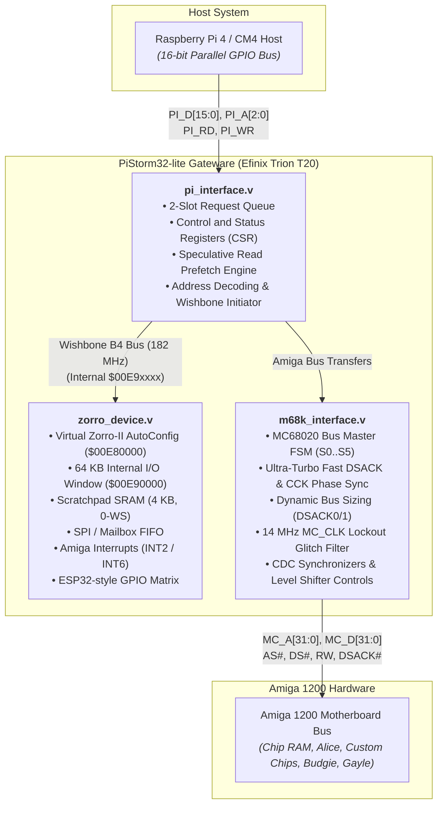

# PiStorm32-lite Architecture

Efinix Trion T20 FPGA gateware design for the PiStorm32-lite accelerator.

---

## 1. Block Diagram

---

## 2. Module Responsibilities

### `PS32-lite.v` (Top Level)
- Synthesizes `sys_clk` (198.6–200.5 MHz, 14x multiplier) from `MC_CLK` using the Efinix PLL (`AMIPLL`).
- Decodes target addresses:
  - Internal ranges (`$00E80000`–`$00E9FFFF`): routed to `zorro_device.v`.
  - External ranges (Chip RAM, chipset, ROM): routed to `m68k_interface.v`.
- Generates direction and enable signals for the 74CB3T3245 bus switches.

### `pi_interface.v`
- Implements the 16-bit parallel host bus interface.
- Manages the two-request-slot queue, allowing the Pi to submit a second transaction while the first is running on the Amiga bus.
- Implements the speculative 32-bit read prefetch engine.
- Filters keyboard reset (`PI_KBRESET`) to avoid false Ctrl-Amiga-Amiga triggers during host-initiated resets.

### `m68k_interface.v`
- Executes standard MC68020 bus cycles ($S_0 \to S_1 \to S_2 \to S_3 \to S_4 \to S_5$).
- Ultra-Turbo bus engine: Fast DSACK termination (-82 ns dead time) and 7.09 MHz CCK phase alignment.
- DMA-immune CCK phase auto-calibration locking 100% of reads to Phase 1 (527 ns) and writes to Phase 0 (456 ns).
- Handles dynamic bus sizing via `DSACK0_n` / `DSACK1_n` (8-bit, 16-bit, and 32-bit ports).
- Filters 14.18 MHz `MC_CLK` with a 3-tick lockout counter to prevent false triggers from 1.8V ringing dips.
- Samples read data (`DA_IN`) unconditionally on falling clock edges, matching upstream gateware timing.

### `zorro_device.v`
- Emulates AutoConfig ROM nibbles at `$00E80000` (Manufacturer ID 28020, Product ID 0x32).
- Maps a 64 KB Wishbone B4 memory space at `$00E90000`.
- Wishbone slaves:
  - Slave 0 (`+$0000`): Scratchpad SRAM (4 KB, 0 wait states), `BUS_CTRL` (`+$1C`), and hardware profiler telemetry registers (`+$20`..`+$34`).
  - Slave 1 (`+$1000`): SPI / Coprocessor mailbox FIFO.
  - Slave 2 (`+$2000`): ESP32-style GPIO matrix and IO MUX.
  - Slave 3 (`+$3000`): Interrupt controller (asserts Amiga INT2 and INT6).

---

## 3. Clocking & Timing Closure

### Clock Domains

| Clock | Frequency | Source | Function |
| :--- | :---: | :--- | :--- |
| `MC_CLK` | 14.18758 MHz (PAL) / 14.31818 MHz (NTSC) | Amiga Trapdoor Pin 87 (Budgie) | Amiga bus clock reference & PLL input |
| `sys_clk` | 198.63 MHz (PAL) / 200.45 MHz (NTSC) | Efinix PLL (`AMIPLL`, 14x multiplier) | Internal FPGA core, FSM, and Wishbone bus |
| `PIN_CCK` | Variable (up to 50 MHz) | Raspberry Pi Host | Pi host parallel interface clock |

> [!NOTE]
> **PLL Multiplier & Frequency Calculation:**
> The PiStorm32-lite board does not feature an onboard oscillator; its internal system clock is derived entirely from the Amiga motherboard's `MC_CLK` using Efinix `AMIPLL` configured with `multiplier=112` and `post_divider=8` (exact $\mathbf{14\times}$ multiplier):
> - **PAL Amiga 1200:** $14.18758\text{ MHz} \times 14 = \mathbf{198.626\text{ MHz}}$ ($T = 5.035\text{ ns}$)
> - **NTSC Amiga 1200:** $14.31818\text{ MHz} \times 14 = \mathbf{200.455\text{ MHz}}$ ($T = 4.989\text{ ns}$)
> - **SDC Target Constraint:** $5.000\text{ ns}$ ($200.000\text{ MHz}$, colloquially "200 MHz Build")
> 
> **Why 14x Multiplier?**
> A $14\times$ multiplier provides exact integer symmetry: each 14.19 MHz half-cycle consists of exactly **7 FSM ticks high and 7 FSM ticks low**, completely eliminating the half-cycle quantization jitter of the older 13x ($6.5$ ticks) build. Furthermore, 1 CCK (7.09 MHz Color Clock) cycle maps to exactly **28 FSM ticks** ($14+14$).

### Clock Domain Crossing
- Amiga bus signals (`MC_CLK`, `MC_RESET_n`, `MC_HALT_n`, `MC_IPL_n`) use 2-stage synchronizers (`mc_clk_raw_sync`).
- Control signals from the host Pi pass through registered inputs in `pi_interface.v`.
- Wishbone bus transactions run synchronously on `sys_clk` with full handshake support (`wb_ack_o`).

### Static Timing Analysis (Efinix Efinity 2026.1)
Target device: **Trion T20Q144 C4**

- Target constraint: 200.000 MHz ($T_{\text{period}} = 5.000\text{ ns}$)
- Achieved $f_{\max}$: **202.347 MHz** ($T_{\min} = 4.942\text{ ns}$)
- Setup slack: **+0.058 ns** (Met)
- Hold slack: **+0.307 ns** (Met)
- Device Resource Utilization:
  - Logic Elements: **2,801 / 19,728 (14.20%)** — *over 85% free for Wishbone expansions*
  - Block RAMs (M4K): **0 / 204 (0.00%)** — *100% (1,044 Kbits) unallocated*
  - DSP Multipliers: **0 / 36 (0.00%)** — *100% unallocated*
