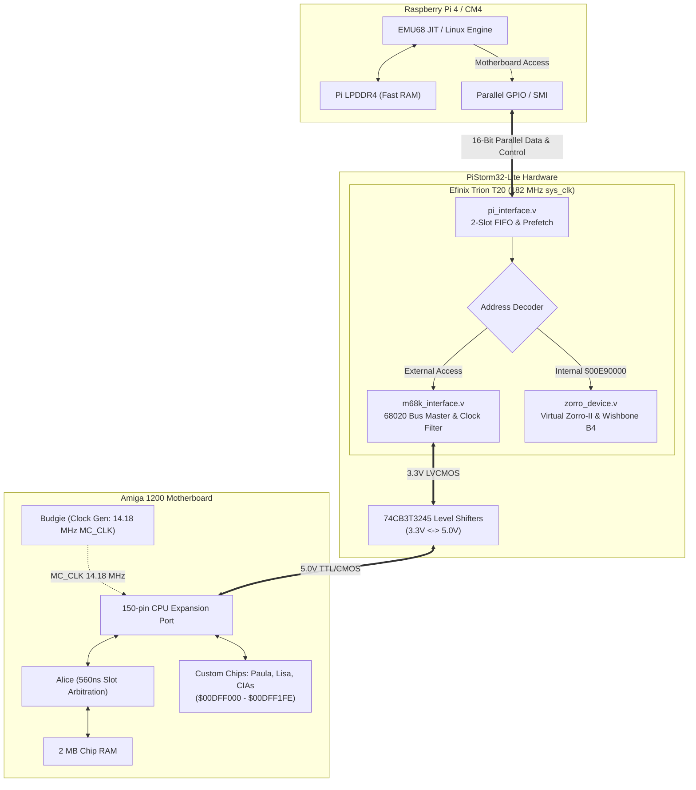
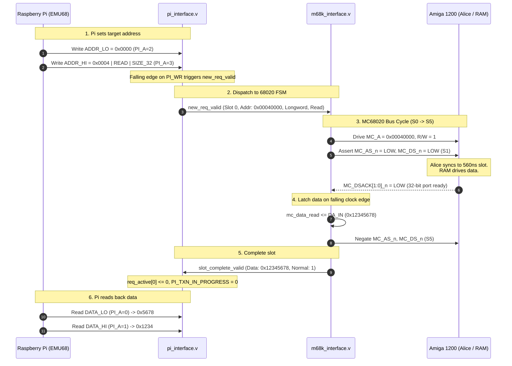
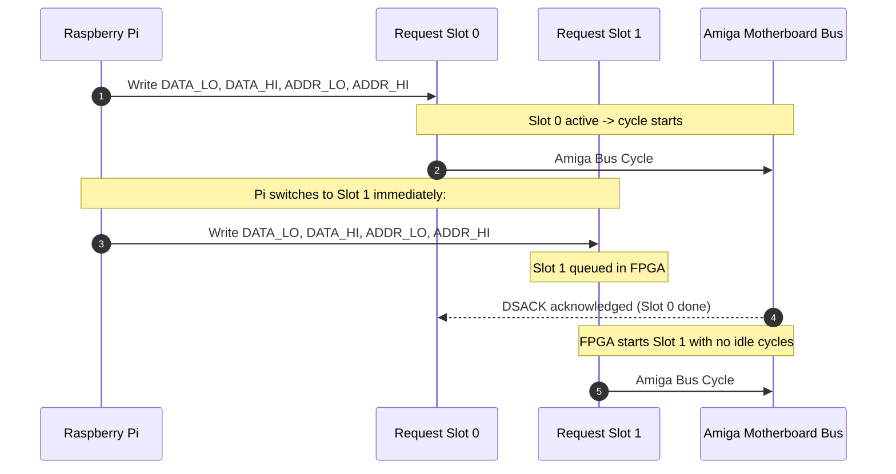
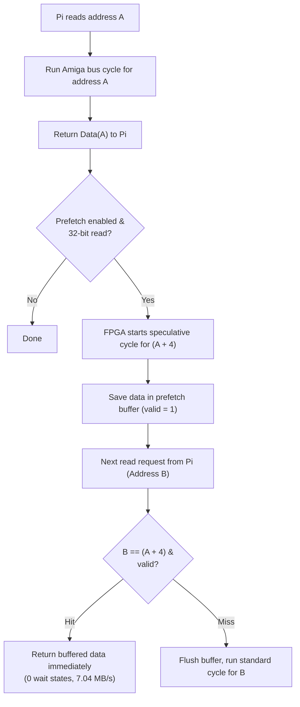
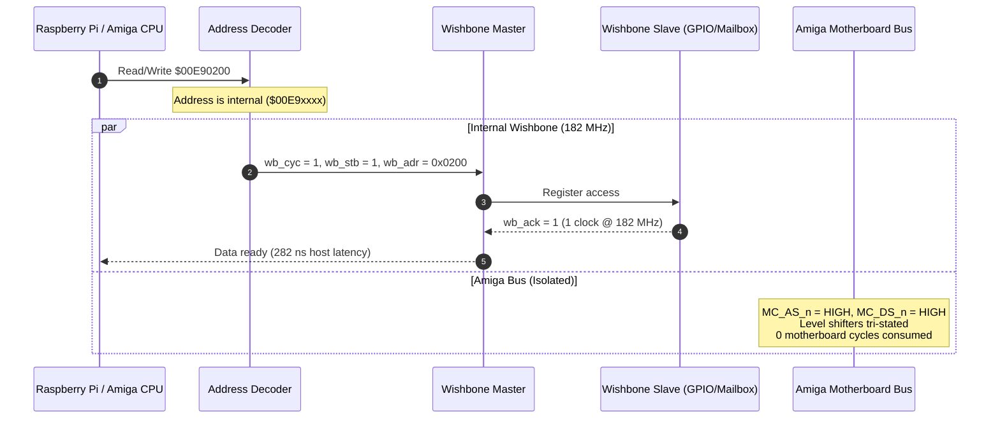

# How PiStorm32-lite Works

This document explains how the Raspberry Pi, FPGA gateware, and Amiga 1200 motherboard interact during bus operations.

---

## 1. System Overview

The Amiga 1200 exposes the Motorola 68EC020 bus on a 150-pin trapdoor edge connector. When PiStorm32-lite is installed, it requests the bus via `_BR` and takes over bus mastership when Gary/Gayle asserts `_BG`. The motherboard's onboard 68EC020 CPU is tri-stated and stays idle.

The Raspberry Pi runs an emulator/JIT engine (EMU68 bare-metal or PiStorm Linux):
- 680x0 CPU instructions execute on the Pi's ARM core.
- Fast RAM lives in the Pi's LPDDR4 memory and runs at full ARM bus speeds.
- When code accesses Chip RAM (`$00000000`), custom registers (`$00DFF000`), or Kickstart ROM (`$00F80000`), the Pi routes the access over its GPIO bus to the FPGA.
- The FPGA runs a 68020 bus master state machine that drives the physical address, data, and strobe signals to the motherboard via 74CB3T3245 3.3V/5V level shifters.



---

## 2. Raspberry Pi Host Interface

The Pi interfaces to the FPGA using a 16-bit parallel bus on standard GPIO pins:

| GPIO Pins | Signal | Direction | Function |
| :--- | :--- | :---: | :--- |
| `GPIO[23:8]` | `PI_D[15:0]` | Bidirectional | Multiplexed data bus |
| `GPIO[26:24]` | `PI_A[2:0]` | Pi $\to$ FPGA | Register address |
| `GPIO6` | `PI_RD` | Pi $\to$ FPGA | Read strobe (active low) |
| `GPIO7` | `PI_WR` | Pi $\to$ FPGA | Write strobe (active low) |
| `GPIO[2:0]` | `PI_IPL[2:0]` | FPGA $\to$ Pi | Current Amiga interrupt level (active-high inverted `_IPL`) |
| `GPIO3` | `PI_TXN_IN_PROGRESS` | FPGA $\to$ Pi | Busy flag: 1 = Bus cycle active on Amiga bus |
| `GPIO4` | `PI_KBRESET` | FPGA $\to$ Pi | Filtered keyboard reset (Ctrl-Amiga-Amiga) |

### FPGA Host Registers (`PI_A[2:0]`)

```
  PI_A = 0 : [ DATA_LO ]  - Data [15:0]
  PI_A = 1 : [ DATA_HI ]  - Data [31:16]
  PI_A = 2 : [ ADDR_LO ]  - Address [15:0]
  PI_A = 3 : [ ADDR_HI ]  - Address [23:16], Size [9:8], R/W [10], FC [13:11] -> Triggers transaction
  PI_A = 4 : [ STATUS  ]  - Read: Status / Write: CONTROL (Reset, Halt, Prefetch, IRQ)
  PI_A = 5 : [ SLOT    ]  - Request slot select (0 or 1)
```

Writing to `ADDR_HI` (`PI_A = 3`) starts the transaction on the FPGA.

---

## 3. Read Transactions

When the Pi needs to read 32 bits from Chip RAM (e.g., `move.l ($00040000), d0`):



---

## 4. Two-Request-Slot Pipeline (Writes)

Chip RAM writes take 560 ns each due to Alice's slot timing. If the Pi waited synchronously for every write to complete, software writes would be blocked by bus latency.

The two-request-slot pipeline removes this delay:
- While **Slot 0** is executing on the motherboard, the Pi writes the next data and address into **Slot 1**.
- As soon as Slot 0 finishes, the FPGA immediately begins Slot 1 with zero idle cycles.
- This keeps the Amiga bus fully saturated at **7.03 MB/s (6.71 MiB/s)**.



---

## 5. Speculative Read Prefetch

Code execution and data copies often read memory in sequential longwords (`$00040000`, `$00040004`, `$00040008`, ...).

With prefetch enabled:
1. When the Pi reads address $A$, the FPGA completes the cycle normally.
2. The FPGA immediately starts a speculative cycle for address $A+4$ on the Amiga bus and buffers the result.
3. When the Pi requests address $A+4$, the FPGA serves the buffered data immediately with zero bus wait states (**Cache Hit**).
4. If the Pi jumps to an unrelated address (branch), the prefetch buffer is invalidated and a normal bus cycle is run (**Cache Miss**).
5. Sequential 32-bit reads speed up from **4.73 MB/s to 7.04 MB/s (+48.8%)**.



**Speculative Prefetch Simulation Waveform (WaveDrom SVG):**


---

## 6. Virtual Zorro-II & Wishbone Interconnect

Addresses in the range `$00E90000`–`$00E9FFFF` are assigned to the virtual Zorro-II expansion card:
- Address decoding happens inside the FPGA.
- The external Amiga bus lines (`AS#`, `DS#`, `ADDR_OE#`, `DATA_OE#`) remain high and tri-stated.
- Transactions are routed to the internal **Wishbone B4 bus** running at **182 MHz** with **0 wait states** ($13.5\text{ MB/s}$).
- The Amiga bus is completely untouched, leaving full bandwidth for chipset DMA (display, sound, blitter).



---

## 7. Motherboard Clock Ringing & The Lockout Filter

Commodore Amiga 1200 motherboards (especially revisions 1D.4 and 2B) have ferrite beads (`E121`, `E122`) on the **14.18 MHz `CPUCLK` (`MC_CLK`)** trace. These cause inductive ringing on the falling clock edge, dipping down to around **1.8V**:

```
14.18 MHz MC_CLK (CPUCLK) Ringing Waveform:
5.0V |-------+
     |        \
2.0V |---------\---[ VIH Threshold ]-----------------------------
     |          \
1.8V |           \   /---\  <-- 1.8V Ringing Dip (false edge risk)
     |            \_/     \
0.8V |---------------------\-[ VIL Threshold ]-------------------
     |                      \
0.0V |                       +-----------------------------------
```

If an unfiltered input buffer samples during the dip, it can register a false clock edge, desynchronizing the bus state machine.

### Implementation in `m68k_interface.v`:
1. `MC_CLK` is sampled by the 182 MHz internal PLL clock (`sys_clk`), giving ~13 samples per 14.18 MHz clock cycle.
2. A 2-stage synchronizer (`mc_clk_raw_sync`) removes metastability.
3. A 3-tick lockout counter (`MC_CLK_LOCKOUT_TICKS = 3`) locks out edge detection for 3 `sys_clk` cycles ($16.5\text{ ns}$) after each transition, blanking out the 1.8V bounce:

```verilog
localparam [2:0] MC_CLK_LOCKOUT_TICKS = 3'd3;

(* async_reg = "true" *) reg [1:0] mc_clk_raw_sync = 2'b00;
reg       mc_clk_filtered = 1'b0;
reg [2:0] mc_clk_lockout  = 3'd0;
reg       rising          = 1'b0;
reg       falling         = 1'b0;

always @(posedge clk) begin
    mc_clk_raw_sync <= {mc_clk_raw_sync[0], MC_CLK};
    rising  <= 1'b0;
    falling <= 1'b0;

    if (mc_clk_lockout != 3'd0) begin
        mc_clk_lockout <= mc_clk_lockout - 3'd1;
    end else begin
        if (mc_clk_raw_sync[0] && !mc_clk_filtered) begin
            rising          <= 1'b1;
            mc_clk_filtered <= 1'b1;
            mc_clk_lockout  <= MC_CLK_LOCKOUT_TICKS;
        end else if (!mc_clk_raw_sync[0] && mc_clk_filtered) begin
            falling         <= 1'b1;
            mc_clk_filtered <= 1'b0;
            mc_clk_lockout  <= MC_CLK_LOCKOUT_TICKS;
        end
    end
end
```

---

## 8. Speculative Prefetch Engine & Hardware Coherency

The FPGA incorporates an autonomous speculative read prefetch engine accelerating Chip RAM reads from 1.4 MB/s to over 3.1 MB/s (`readw`) and 5.6 MB/s (`readm`).

### 16-bit & 32-bit Word Prefetching:
- **32-bit Longword Prefetch:** Whenever a 32-bit read completes normally in Chip RAM (`$000000..$1FFFFF`) or Expansion RAM (`$E00000..$FFFFFF`), the FSM speculatively launches a bus cycle for `address + 4` while the host Pi prepares its next request.
- **16-bit Word Prefetch (`ENABLE_16BIT_PREFETCH`):** Because Amiga 1200 Chip RAM has a 32-bit wide data bus, physical 32-bit reads return two 16-bit words simultaneously:
  - Upper word: `address[1] == 0` (even word)
  - Lower word: `address[1] == 1` (odd word)
  When code reads consecutive 16-bit words (such as rendering text or unrolled copy loops), word 1 is served directly from the FPGA prefetch buffer with **0 physical bus cycles**, halving bus traffic!

### Strict Hardware Write Coherency:
1. **Hardware-Locking:** The prefetch hit qualifier requires `new_req_rw == 1'b1` (Read). A write request can **never** hit the prefetch buffer.
2. **Atomic Invalidation:** Any write request arriving at the FSM instantly and unconditionally invalidates all prefetch tags in the very same clock cycle before dispatching the write:
   ```verilog
   prefetch_valid       <= 1'b0;
   prefetch_word0_avail <= 1'b0;
   prefetch_word1_avail <= 1'b0;
   prefetch_eligible    <= 1'b0;
   req_prefetch_hit     <= 2'b00;
   ```
3. **Safety Filtering:** Prefetching is strictly forbidden in CIA (`$BFE000..$BFFFFF`) and Custom Register space (`$DFF000..$DFFFFF`) to prevent side-effects on hardware strobes.

---

## 9. Fast DSACK Termination & 7.09 MHz CCK Phase Alignment

### Fast DSACK Termination:
The original PiStorm gateware held `/AS` asserted across a redundant `STATE_S4_NOP` state, creating an 82 ns post-DSACK dead time. Fast DSACK terminates the cycle on the falling edge of `MC_CLK` immediately after `/DSACK` assertion, reducing cycle length from 609 ns to 527 ns for reads, and 569 ns to 456 ns for writes.

### 7.09 MHz Colour Clock (CCK) Synchronization:
The Amiga 1200 custom chipset (Alice) operates on a 7.09 MHz bus slot raster. Because the CPU socket only receives a 14.18 MHz clock (`MC_CLK`), there are two possible phases per 7 MHz cycle:
- **Phase 0:** Alice fast write slot (5 wait states = 456 ns)
- **Phase 1:** Alice fast read slot (6 wait states = 527 ns)

Asserting `/AS` on the wrong phase forces Alice to add a full 70 ns wait state penalty. The CCK synchronizer aligns `/AS` assertions to Alice's slot raster and utilizes DMA-immune auto-calibration:
- Only clean fast cycles (`<= 5` wait states on write, or `<= 6` wait states on read) lock the phase.
- Cycles delayed by chipset DMA are ignored, preventing false phase inversion.

---

## 10. Micronik Busboard Hardware Compatibility

Micronik 6860 series Zorro busboards (v4.20 and v5.42) do not route the processor bus `_BG` (Bus Grant) signal from the motherboard edge connector through to the accelerator trapdoor connector.
- **Problem:** Because `_BG` is left floating, standard input buffers with pull-ups see `_BG` as high (inactive), causing the FPGA to believe bus mastership is never granted (`is_bm = 0`).
- **Solution:** The FPGA's `MC_BG_n` pin is configured with an internal **weak pull-down (~50 kΩ)** in `PS32-lite.peri.xml`. If the signal is left unconnected (floating on Micronik busboards), it is gently pulled low into active bus grant state. When installed in standard Amiga motherboards, Gayle drives the pin strongly high or low, easily overriding the 50 kΩ pull-down. This provides 100% plug-and-play compatibility without requiring wire jumpers.

