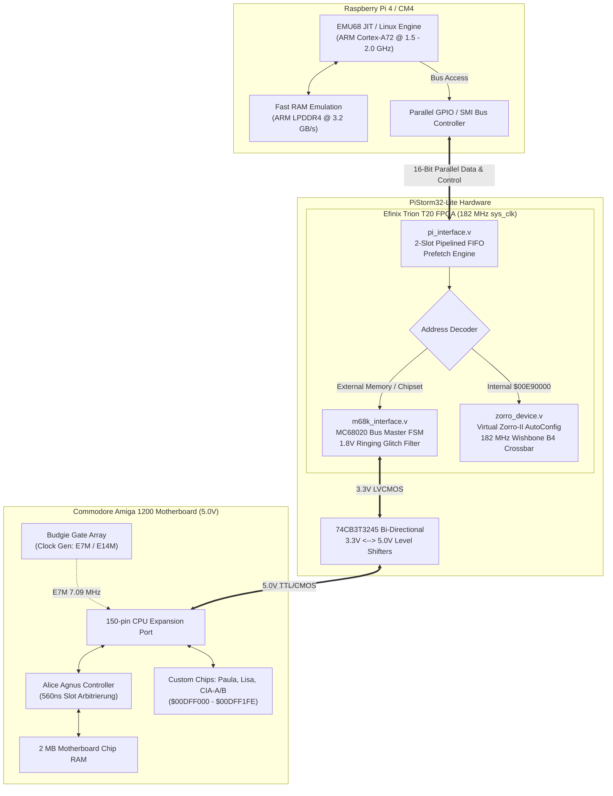
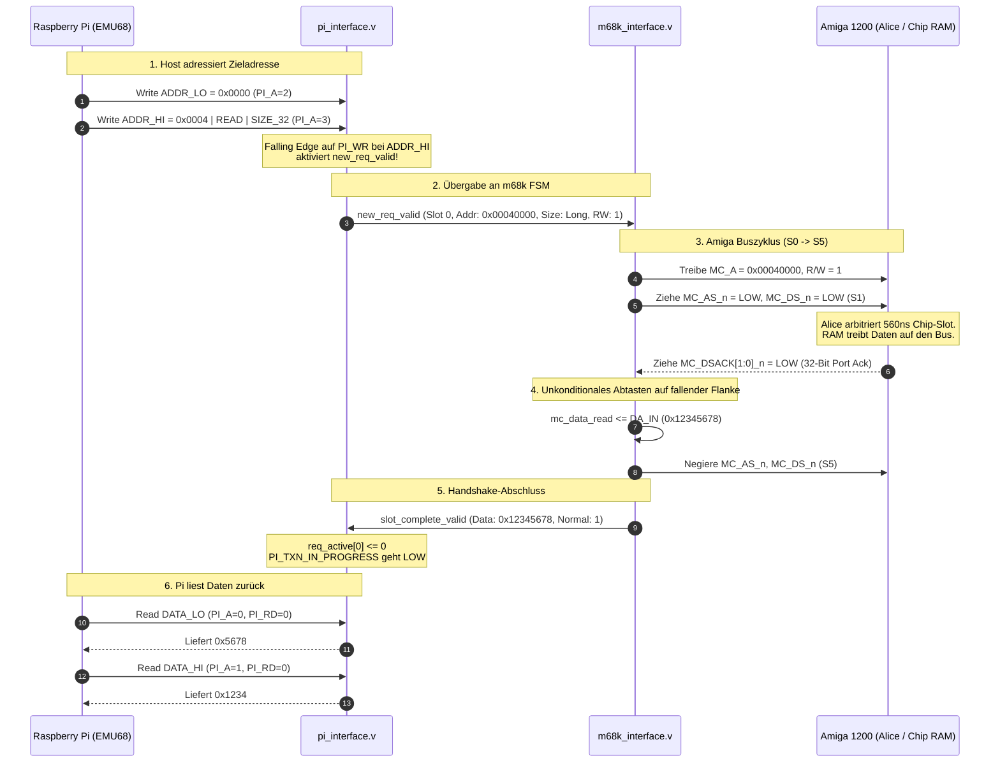
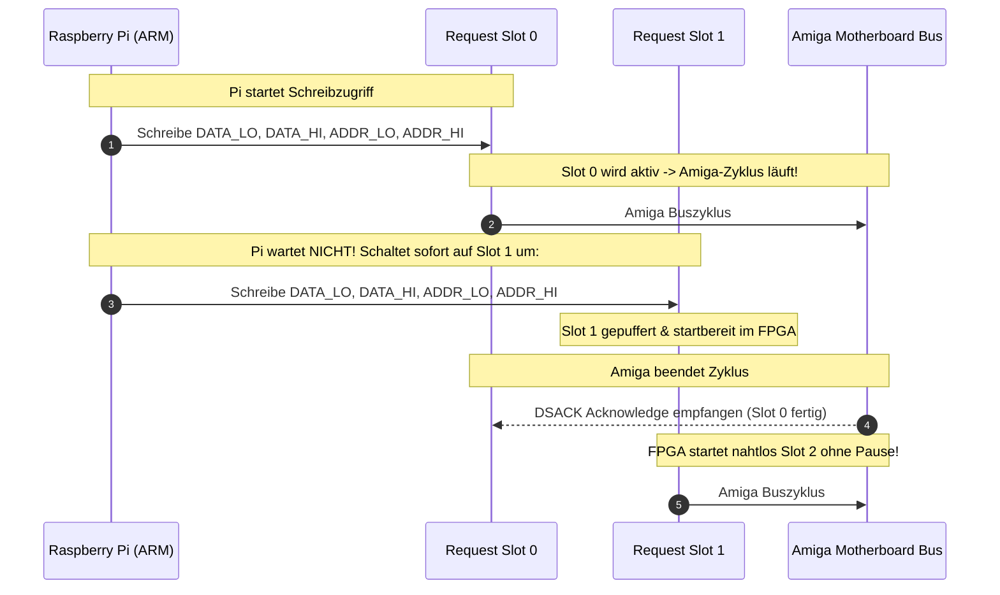
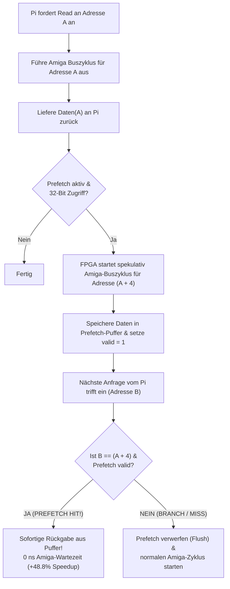
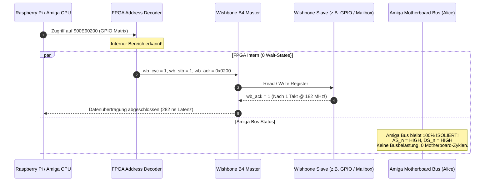

# Wie funktioniert PiStorm32-lite? Das System & Protokoll im Detail

> **"Wie funktioniert das Ding eigentlich?"**  
> Dieses Dokument erklärt Schritt für Schritt, wie ein moderner ARM-Prozessor (Raspberry Pi 4 / CM4) über die FPGA-Gateware nahtlos als vollwertiger 68020/68030/68040-Prozessor auf dem Amiga 1200 Motherboard agiert.

---

## 1. Das Gesamtkonzept (High-Level Architektur)

Ein Commodore Amiga 1200 besitzt auf dem Motherboard keinen fest verlöteten 68030 oder 68040, sondern einen **150-poligen Trapdoor-Erweiterungssteckplatz**. Dieser Steckplatz führt alle Signale des nativen Motorola MC68EC020-Busses heraus (Adressbus `A[31:0]`, Datenbus `D[31:0]`, Steuerleitungen `AS#`, `DS#`, `DSACK[1:0]#`, Interrupts `IPL[2:0]#`, Bus-Arbitrierung `BR#`, `BG#`).

Wenn PiStorm32-lite eingesteckt ist:
1. **Busübernahme:** Das FPGA beansprucht über Bus-Arbitrierung (`_BR` / `_BG`) die alleinige Kontrolle über den Motherboard-Bus. Die Onboard-CPU des Amiga wird abgeschaltet.
2. **CPU-Emulation auf dem Pi:** Der Raspberry Pi führt einen JIT-Compiler aus (z. B. **EMU68** auf Bare-Metal oder die PiStorm-Linux-Software). Der ARM-Core (Cortex-A72 @ 1.5–2.0 GHz) führt Amiga-M68k-Maschinencode mit hunderten MIPS aus.
3. **Hardware-Brücke (FPGA):** Wann immer die emulierte Software auf Amiga-Hardware zugreift (Chip-RAM `$00000000`, Custom Chips `$00DFF000`, ROM `$00F80000`), sendet der Pi den Befehl über seine GPIOs an das FPGA.
4. **Physikalische Buszyklen:** Das FPGA übersetzt die Anforderung in echte elektrische MC68020-Buszyklen für Alice, Paula, Lisa und den Amiga-Bus.



---

## 2. Das Raspberry Pi <-> FPGA Protokoll

Der Raspberry Pi kommuniziert mit dem FPGA über einen **16-Bit parallelen Bus**, der aus Standard-Raspberry-Pi-GPIOs besteht:

| GPIO Pins | Signalname | Richtung | Funktion |
| :--- | :--- | :---: | :--- |
| `GPIO[23:8]` | `PI_D[15:0]` | Bidirektional | Multiplexter 16-Bit Datenbus |
| `GPIO[26:24]` | `PI_A[2:0]` | Pi $\to$ FPGA | Registeradresse im FPGA |
| `GPIO6` | `PI_RD` | Pi $\to$ FPGA | Lese-Strobe (Active Low) |
| `GPIO7` | `PI_WR` | Pi $\to$ FPGA | Schreib-Strobe (Active Low) |
| `GPIO[2:0]` | `PI_IPL[2:0]` | FPGA $\to$ Pi | Aktueller Amiga Interrupt-Level (invertiertes `_IPL`) |
| `GPIO3` | `PI_TXN_IN_PROGRESS` | FPGA $\to$ Pi | Busy-Flag: 1 = Zugriff auf Amiga-Bus läuft |
| `GPIO4` | `PI_KBRESET` | FPGA $\to$ Pi | Gefilterter Tastatur-Reset (Ctrl-Amiga-Amiga) |

### Die internen FPGA-Register (`PI_A[2:0]`)

```
  PI_A = 0 : [ DATA_LO ]  - Datenbits [15:0]
  PI_A = 1 : [ DATA_HI ]  - Datenbits [31:16]
  PI_A = 2 : [ ADDR_LO ]  - Adressbits [15:0]
  PI_A = 3 : [ ADDR_HI ]  - Adressbits [23:16], Size [9:8], R/W [10], FC [13:11] -> STARTET ZUGRIFF!
  PI_A = 4 : [ STATUS  ]  - Read: Status / Write: CONTROL (Reset, Halt, Prefetch, IRQ)
  PI_A = 5 : [ SLOT    ]  - Request-Slot Umschaltung (Slot 0 / Slot 1)
```

---

## 3. Ablauf eines Amiga-Lesezugriffs (Read Cycle)

Wenn EMU68 ein Longword (`move.l ($00040000), d0`) aus dem Chip-RAM liest:



---

## 4. Pipelined 2-Request-Slot Engine (High-Speed Writes)

Bei vielen Schreibzugriffen hintereinander (z. B. Framebuffer-Kopieren ins Chip-RAM) würde ein einfacher Bus-Master den Pi ausbremsen, weil jeder Amiga-Slot **560 ns** dauert.

PiStorm32-lite löst dies mit einer **2-Slot Pipeline**:
- Während **Slot 0** auf dem Amiga-Motherboard noch von Alice verarbeitet wird, schreibt der Pi bereits die Daten für **Slot 1** in das FPGA!
- Sobald Slot 0 fertig ist, startet das FPGA **unterbrechungsfrei** sofort Slot 1.
- Dadurch erreicht das System **volle 7.03 MB/s (6.71 MiB/s)** – das absolute physikalische Limit des Amiga 1200 Chip-Busses.



---

## 5. Die spekulative Read-Prefetch Engine

Beim Lesen von Befehlen oder Daten liest die CPU meistens streng sequentiell aufsteigend: `$00040000`, `$00040004`, `$00040008`, ...

Da der Amiga-Bus $560\text{ ns}$ pro Longword benötigt, müsste die CPU normalerweise bei jedem Lesebefehl $560\text{ ns}$ Däumchen drehen.

**So funktioniert der PiStorm32-lite Prefetch:**
1. Sobald der Pi Adresse $A$ liest, holt die Gateware die Daten wie gewohnt.
2. Noch **bevor** der Pi den nächsten Lesebefehl sendet, spekuliert das FPGA: *"Die nächste Adresse ist garantiert $A+4$!"*
3. Das FPGA startet eigenständig und vorab einen Amiga-Buszyklus für $A+4$ und legt die Daten in einen internen Puffer.
4. Fragt der Pi kurz darauf tatsächlich $A+4$ an $\rightarrow$ **Cache Hit!**
5. Das FPGA liefert die Daten **sofort (ohne Amiga-Bus-Wartezeit)** zurück!
6. Ergebnis: Der Durchsatz steigt von **$4.73\text{ MB/s}$ auf $7.04\text{ MB/s}$ (+48.8% Beschleunigung)**!



---

## 6. Virtual Zorro-II AutoConfig & Wishbone Bus (182 MHz Interconnect)

Wenn der Pi oder ein Amiga-Treiber auf Adressen im Bereich `$00E90000`–`$00E9FFFF` zugreift:
- Das FPGA erkennt diesen Adressbereich rein intern.
- Die externen Amiga-Bus-Treiber (`ADDR_OE#`, `DATA_OE#`, `AS#`, `DS#`) bleiben **vollständig inaktiv (Hi-Z)**.
- Der Zugriff wird mit **182 MHz Taktrate** in **0 Wait-States** über den internen Wishbone B4 Crossbar abgewickelt ($13.5\text{ MB/s}$).
- Der Amiga-Bus bleibt zu 100% frei für Chip-DMA (Grafik, Sound, Floppy).



---

## 7. Der 1.8V Ringing Glitch-Filter im Detail

Auf originalen Amiga 1200 Motherboards (vor allem Rev 1D.4 und Rev 2B) befinden sich Ferritperlen und Kondensatoren auf der Taktleitung (`E121`, `E122`). Diese erzeugen bei fallender Taktflanke extreme Überschwinger und einen Spannungseinbruch (Ringing Dip) auf etwa **1.8 Volt**:

```
Amiga E7M Taktverlauf (Oszilloskop):
5.0V |-------+
     |        \
2.0V |---------\---[ Logische 1 / VIH-Schwelle ]-----------------------
     |          \
1.8V |           \   /---\  <-- 1.8V Ringing Dip!
     |            \_/     \     (Ungefiltert: löst falsche Taktflanke aus!)
0.8V |---------------------\-[ Logische 0 / VIL-Schwelle ]-------------
     |                      \
0.0V |                       +-----------------------------------------
```

### Die Lösung im FPGA:
1. Das FPGA tastet `E7M` mit seinem internen **$182\text{ MHz}$ PLL-Takt** ab ($\approx 25$ Abtastungen pro E7M-Takt).
2. Ein **2-stufiges Synchronisationsregister** (`e7m_sync[1:0]`) eliminiert Metastabilität.
3. Der **Deglitch-Filter** verlangt, dass ein neuer Signalzustand stabil über mehrere interne Zyklen anliegt, bevor er als Flanke gewertet wird:

```verilog
always @(posedge sys_clk) begin
    e7m_sync <= {e7m_sync[0], E7M};
    if (e7m_sync[1] == e7m_sync[0]) begin
        e7m_filtered <= e7m_sync[1];
    end
end
```

Kurze Störspitzen und der 1.8V-Dip dauern weniger als $10\text{ ns}$ und werden vom Filter **vollkommen ignoriert**. Echte Taktflanken werden ohne messbaren Jitter und ohne Amiga-Taktverlust erkannt.
