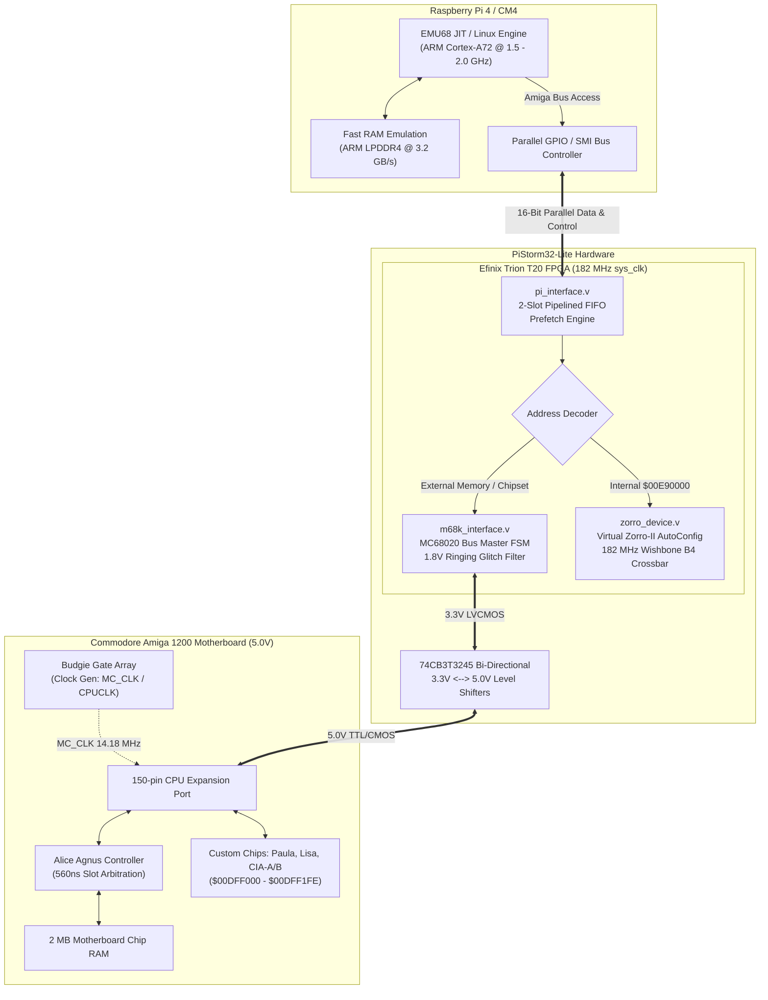
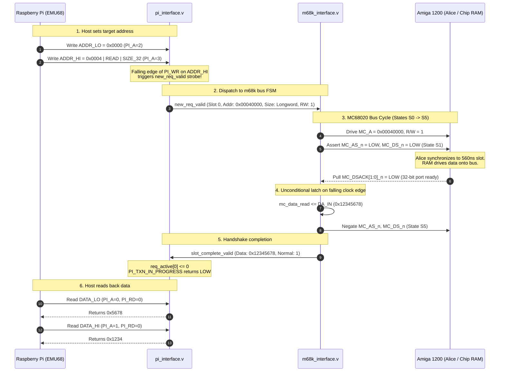
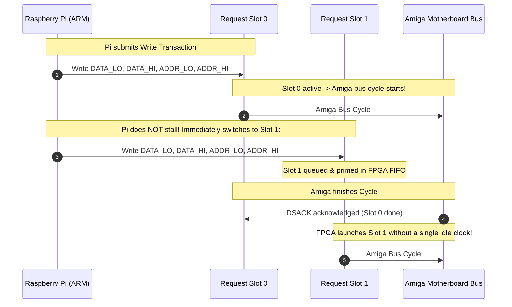
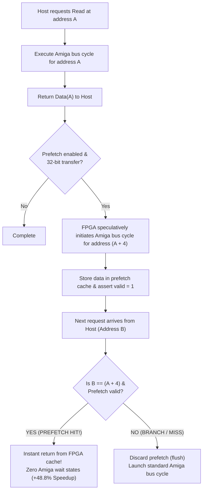
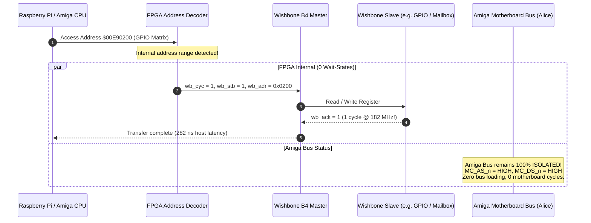

# How PiStorm32-lite Works: The Architecture & Protocol Guide

> **"How does this thing actually work?"**  
> This document explains step-by-step how a modern ARM host (Raspberry Pi 4 / Compute Module 4) interfaces through the FPGA gateware to seamlessly act as a full-featured Motorola 68020/68030/68040 processor on the Commodore Amiga 1200 motherboard.

---

## 1. High-Level Concept & System Topology

The Commodore Amiga 1200 does not have a soldered-down processor on its motherboard; instead, it features a **150-pin trapdoor CPU expansion slot**. This connector exposes all native Motorola MC68EC020 bus lines (address bus `A[31:0]`, data bus `D[31:0]`, control strobes `_AS`, `_DS`, `_DSACK[1:0]`, interrupt priority levels `_IPL[2:0]`, and bus arbitration lines `_BR`, `_BG`).

When the PiStorm32-lite is installed:
1. **Bus Master Takeover:** The FPGA requests and assumes permanent bus mastership via the MC68020 bus arbitration protocol (`_BR` asserted, waiting for `_BG` and `_AS` negated). The onboard 68EC020 CPU is tri-stated and held dormant.
2. **CPU Emulation on the Raspberry Pi:** The Raspberry Pi runs a high-performance JIT execution engine (such as **EMU68** on bare metal or the PiStorm Linux kernel driver). The ARM core (Cortex-A72 @ 1.5–2.0 GHz) executes Amiga m68k instructions at hundreds of MIPS.
3. **Hardware Bridge (FPGA):** Whenever emulated software accesses real Amiga physical resources (Chip RAM `$00000000`, Custom Chip registers `$00DFF000`, Kickstart ROM `$00F80000`), the Pi dispatches the request over its parallel GPIO bus to the FPGA.
4. **Physical Bus Cycles:** The FPGA translates the high-speed request into electrically compliant MC68020 bus cycles for Alice, Paula, Lisa, and the Amiga 1200 motherboard.



---

## 2. Raspberry Pi <-> FPGA Parallel Bus Protocol

The Raspberry Pi communicates with the FPGA over a **16-bit parallel bus** mapped directly to the Pi's 40-pin GPIO header:

| GPIO Pins | Signal Name | Direction | Functional Description |
| :--- | :--- | :---: | :--- |
| `GPIO[23:8]` | `PI_D[15:0]` | Bidirectional | Multiplexed 16-bit data bus |
| `GPIO[26:24]` | `PI_A[2:0]` | Pi $\to$ FPGA | Internal FPGA register address |
| `GPIO6` | `PI_RD` | Pi $\to$ FPGA | Read strobe (active-low) |
| `GPIO7` | `PI_WR` | Pi $\to$ FPGA | Write strobe (active-low) |
| `GPIO[2:0]` | `PI_IPL[2:0]` | FPGA $\to$ Pi | Current Amiga interrupt priority level (active-high inverted `_IPL`) |
| `GPIO3` | `PI_TXN_IN_PROGRESS` | FPGA $\to$ Pi | Busy flag: 1 = Bus transaction in progress on Amiga bus |
| `GPIO4` | `PI_KBRESET` | FPGA $\to$ Pi | Filtered keyboard reset signal (Ctrl-Amiga-Amiga) |

### Internal FPGA Host Registers (`PI_A[2:0]`)

```
  PI_A = 0 : [ DATA_LO ]  - Data bits [15:0]
  PI_A = 1 : [ DATA_HI ]  - Data bits [31:16]
  PI_A = 2 : [ ADDR_LO ]  - Address bits [15:0]
  PI_A = 3 : [ ADDR_HI ]  - Address bits [23:16], Size [9:8], R/W [10], FC [13:11] -> TRIGGERS TRANSACTION!
  PI_A = 4 : [ STATUS  ]  - Read: Status / Write: CONTROL (Reset, Halt, Prefetch, IRQ)
  PI_A = 5 : [ SLOT    ]  - Request slot selection (Slot 0 / Slot 1)
```

---

## 3. Amiga Motherboard Read Transaction Flow

When the CPU emulation executes a 32-bit read from Chip RAM (`move.l ($00040000), d0`):



---

## 4. Pipelined Two-Request-Slot Engine (High-Speed Writes)

During back-to-back writes (such as copying a bitmap or framebuffer into Chip RAM), a naive single-slot bus master would force the Raspberry Pi CPU to stall while the slow Amiga motherboard completes each **560 ns** bus slot.

PiStorm32-lite eliminates this bottleneck using a **Pipelined Two-Request-Slot Queue**:
- While **Slot 0** is executing on the Amiga motherboard, the Raspberry Pi concurrently submits the data and address for **Slot 1** into the FPGA.
- The instant Slot 0 completes on the Amiga bus, the FPGA transitions seamlessly into Slot 1 with zero idle cycles.
- This decoupling allows write throughput to reach **7.03 MB/s (6.71 MiB/s)**—the absolute theoretical maximum of the Amiga 1200 32-bit Chip RAM bus.



---

## 5. Speculative Read-Prefetch Engine

When software reads instructions or sequential data structures, memory accesses are predominantly consecutive longwords: `$00040000`, `$00040004`, `$00040008`, ...

Because each Chip RAM read requires a 560 ns motherboard slot, sequential reading typically limits throughput to $4.73\text{ MB/s}$.

**How PiStorm32-lite Speculative Prefetch Works:**
1. When the host reads address $A$, the FPGA completes the bus cycle normally.
2. Even **before** the Pi requests the next longword, the FPGA speculates: *"The next requested address is almost certainly $A+4$!"*
3. The FPGA immediately launches an autonomous Amiga bus cycle for address $A+4$ and stores the returned longword in a local prefetch buffer.
4. When the Pi subsequently requests address $A+4$ $\rightarrow$ **Cache Hit!**
5. The FPGA serves the data **instantaneously from the prefetch buffer with zero Amiga bus latency**!
6. Throughput surges from **$4.73\text{ MB/s}$ to $7.04\text{ MB/s}$ (+48.8% acceleration)**!



---

## 6. Virtual Zorro-II AutoConfig & Wishbone Bus (182 MHz Interconnect)

When the Raspberry Pi or an AmigaOS driver accesses memory within the range `$00E90000`–`$00E9FFFF`:
- The internal address decoder recognizes the virtual expansion card.
- External Amiga bus drivers (`ADDR_OE#`, `DATA_OE#`, `AS#`, `DS#`) remain **completely tri-stated (Hi-Z)**.
- The transaction is routed directly to the internal **Wishbone B4 Crossbar** running at **182 MHz** with **0 wait states** ($13.5\text{ MB/s}$).
- The Amiga motherboard bus remains 100% idle, allowing DMA channels (Blitter, Copper, Audio) to operate with zero contention.



---

## 7. The 1.8V Ringing Glitch Filter on MC_CLK (CPUCLK)

On unmodded Commodore Amiga 1200 motherboards (notably Rev 1D.4 and Rev 2B), ferrite beads and capacitors (`E121`, `E122`) on the **`MC_CLK` / `CPUCLK` (14.18 MHz)** clock line create transmission line reflections. On the falling edge, this produces severe ringing that dips back into the **1.8 Volt** threshold zone:

```
Amiga MC_CLK (CPUCLK 14.18 MHz) Oscilloscope Waveform:
5.0V |-------+
     |        \
2.0V |---------\---[ Logic HIGH / VIH Threshold ]----------------------
     |          \
1.8V |           \   /---\  <-- 1.8V Ringing Dip!
     |            \_/     \     (Unfiltered: triggers false clock edge!)
0.8V |---------------------\-[ Logic LOW / VIL Threshold ]-------------
     |                      \
0.0V |                       +-----------------------------------------
```

### Hardware Implementation in `m68k_interface.v`:
1. The FPGA oversamples `MC_CLK` using its internal **182 MHz PLL clock** (`sys_clk`), yielding $\approx 13$ samples per 14.18 MHz clock cycle.
2. A **2-stage synchronizer** (`mc_clk_raw_sync[1:0]`) eliminates metastability.
3. A **lockout filter counter** (`MC_CLK_LOCKOUT_TICKS = 3`) locks out the edge detector for 3 `sys_clk` cycles ($16.5\text{ ns}$), suppressing false bounces while guaranteeing that legitimate rising and falling edges are detected with zero delay:

```verilog
localparam [2:0] MC_CLK_LOCKOUT_TICKS = 3'd3;

(* async_reg = "true" *) reg [1:0] mc_clk_raw_sync = 2'b00;
reg       mc_clk_filtered = 1'b0;
reg [2:0] mc_clk_lockout  = 3'd0;
reg       rising          = 1'b0;
reg       falling         = 1'b0;

always @(posedge clk) begin
    mc_clk_raw_sync <= {mc_clk_raw_sync[0], MC_CLK};
    rising  <= 1'b0;
    falling <= 1'b0;

    if (mc_clk_lockout != 3'd0) begin
        mc_clk_lockout <= mc_clk_lockout - 3'd1;
    end else begin
        if (mc_clk_raw_sync[0] && !mc_clk_filtered) begin
            rising          <= 1'b1;
            mc_clk_filtered <= 1'b1;
            mc_clk_lockout  <= MC_CLK_LOCKOUT_TICKS;
        end else if (!mc_clk_raw_sync[0] && mc_clk_filtered) begin
            falling         <= 1'b1;
            mc_clk_filtered <= 1'b0;
            mc_clk_lockout  <= MC_CLK_LOCKOUT_TICKS;
        end
    end
end
```
