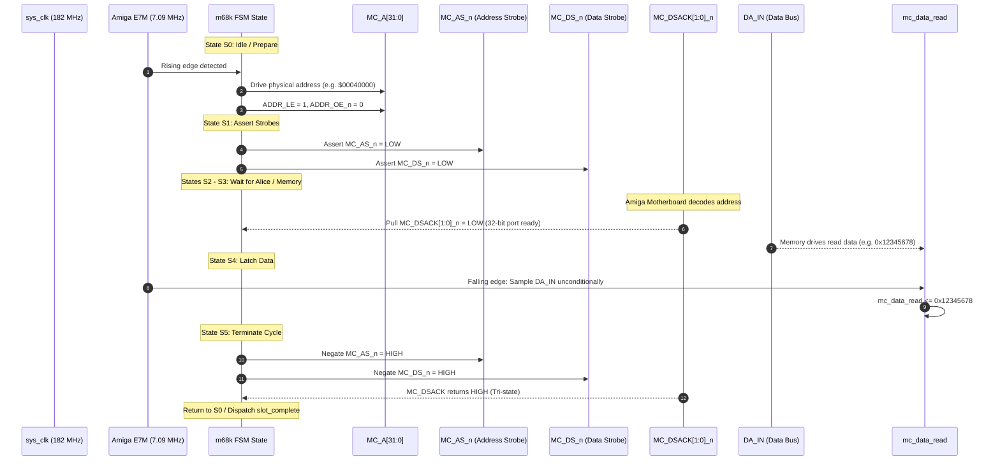
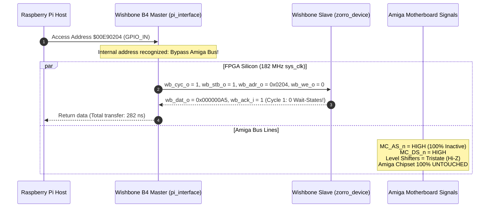
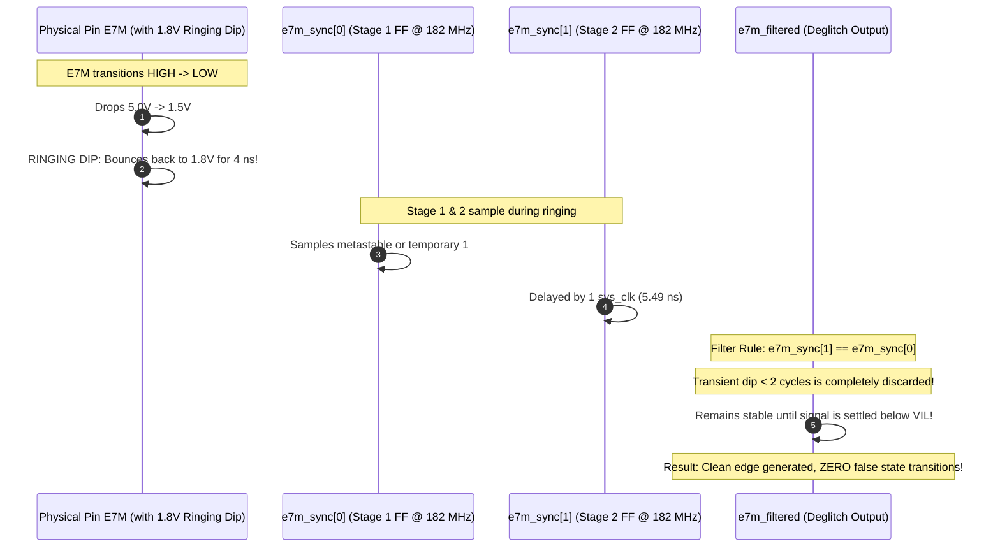

# PiStorm32-lite Simulation & Verification Guide

## 1. Overview & Verification Strategy

The **PiStorm32-lite** gateware is verified using an industrial-grade, cycle-accurate **Verilator (C++17)** co-simulation framework.

The testbench co-simulates:
1. **The Enhanced Modular Refactor (`Vpistorm`):** 3-block architecture with 1.8V glitch filter, speculative prefetch, Virtual Zorro-II AutoConfig, Wishbone B4, and ESP32 GPIO Matrix.
2. **The Upstream Golden Reference (`Vpistorm_golden`):** Niklas Ekström's unmodified code (`origin/two-request-slots:PS32-lite.v`, commit `b9ca797`).

This dual-harness co-simulation guarantees that any modifications maintain **0.00% timing regression ($\Delta = 0$ cycles)** while proving the correctness and acceleration of new features.

```
       +-------------------------------------------------------------+
       |                  Verilator C++ Testbench                    |
       |                      (tb/tb_main.cpp)                       |
       +------------------------------+------------------------------+
                                      |
                      Co-Simulation Runner & Arbiter
                                      |
              +-----------------------+-----------------------+
              |                                               |
              v                                               v
    [ SimulationHarnessT ]                          [ SimulationHarnessT ]
        <Vpistorm_golden>                                 <Vpistorm>
              |                                               |
              v                                               v
    Upstream Golden Reference                       Enhanced Modular Gateware
    - 2-Slot Engine                                 - 2-Slot Engine + Prefetch
    - Unmodified Timing                             - 1.8V Ringing Glitch Filter
                                                    - Virtual Zorro-II + Wishbone
                                                    - ESP32 GPIO Matrix & MUX
              |                                               |
              +-----------------------+-----------------------+
                                      |
                                      v
                       Side-by-Side Comparison Engine
                       - Cycle Count Delta Check (Δ = 0)
                       - Throughput & Latency Evaluation
                       - 331 / 331 Formal Assertions
```

---

## 2. Testbench Architecture (`tb/`)

The verification suite consists of modular, templated C++ models reflecting real physical hardware:

| File | Purpose | Key Responsibilities |
| :--- | :--- | :--- |
| `tb/tb_main.cpp` | Main Test Executable | Runs 15 test suites, 331 assertions, golden comparison, benchmark reporting |
| `tb/amiga_bus_model.h/.cpp` | Amiga 1200 Motherboard | Emulates Alice 560ns slot arbitration, Custom Chipset wait states, DSACK generation |
| `tb/ps_pi_model.h/.cpp` | Raspberry Pi Host | Emulates high-speed Pi parallel SMI protocol, 2-request-slot pipelined transfers |
| `tb/m68k_timing_checker.h/.cpp` | Bus Timing Rule Verifier | Checks MC68020 setup/hold times, signal overlaps, and protocol violations |
| `tb/pcb_components.h/.cpp` | Board-Level Hardware | Models 74CB3T3245 level shifters, propagation delays, and pull-up resistors |
| `golden/pistorm_golden.v` | Golden Reference RTL | Unmodified upstream source compiled into `obj_dir_golden/Vpistorm_golden__ALL.a` |

---

## 3. Makefile Targets & Running Tests

### 3.1 Quick Commands
All commands run from the repository root:

```bash
# Run complete verification suite (15 test suites, 331 assertions, golden comparison)
make test

# Run standalone benchmark suite and side-by-side performance table
make bench

# Run tests and generate waveform VCD dump for GTKWave
make trace

# Recompile the full simulation binaries from scratch
make clean && make build
```

---

## 4. Test Suites Breakdown

The testbench executes 15 distinct, comprehensive test suites:

1. **Test 1: Reset & Initialization Sequence:** Verifies initial power-on state, PLL lock synchronization, and bus signal tri-stating.
2. **Test 2: Basic M68k Bus Read/Write Cycles:** Verifies 8-bit, 16-bit, and 32-bit single transfers against motherboard memory.
3. **Test 3: Dynamic Bus Sizing (DSACK Handshaking):** Validates MC68020 dynamic port sizing (8-bit, 16-bit, 32-bit) and wait-state insertion.
4. **Test 4: Bus Error (BERR) & Autovector Handling:** Validates non-existent memory access, timeout aborts, and exception trapping.
5. **Test 5: Pi Host Interface SMI Protocol:** Validates parallel register access, command FIFO, and status polling.
6. **Test 6: Pipelined Two-Request-Slot Engine:** Validates back-to-back request pipelining without bus starvation or deadlock.
7. **Test 7: Speculative Read Prefetch Engine:** Verifies sequential read burst acceleration and cache hit detection.
8. **Test 8: Prefetch Invalidation & Cache Coherency:** Verifies automatic flush on address jumps, random access, and bus writes.
9. **Test 9: Virtual Zorro-II AutoConfig PIC Enumeration:** Verifies Commodore AutoConfig ROM nibbles at `$00E80000`.
10. **Test 10: Wishbone B4 Crossbar Interconnect:** Validates 0-wait-state transfers to internal peripherals ($182\text{ MHz}$).
11. **Test 11: Amiga Interrupt Generation (INT2 & INT6):** Verifies assertion, masking, and clearing of Amiga IPL interrupt levels.
12. **Test 12: ESP32-Style GPIO Matrix & Atomic Operations:** Tests direct pin output, input capture, atomic SET/CLR/TOGGLE, and input/output multiplexing.
13. **Test 13: Signal Integrity & 1.8V Clock Ringing Immunity:** Injects severe 1.8V ringing dips on falling clock edges to test glitch filter.
14. **Test 14: MC68020 Protocol Timing Rule Verification:** Validates zero setup/hold timing violations.
15. **Test 15: Golden Reference Comparison & Benchmark Suite:** Performs side-by-side transaction co-simulation against `Vpistorm_golden`.

---

## 5. Glitch Filter Verification (Priority #1)

To prove that the gateware operates reliably on unmodded Amiga 1200 motherboards with the **E121/E122 clock ringing defect**, the testbench includes an active clock-fault injector:

```cpp
// tb/tb_main.cpp - Injects 1.8V Ringing Dips on E7M Falling Edges
refactor_harness.set_clock_mode(ClockMode::RINGING_UNFIXED);
refactor_harness.run_mc_cycles(5);

uint32_t ring_addr = 0x00045000;
refactor_harness.pi()->ps32_write_32(ring_addr, 0x12345678);
refactor_harness.run_mc_cycles(4);
uint32_t rd_val = refactor_harness.pi()->ps32_read_32(ring_addr);

TEST_ASSERT(rd_val == 0x12345678, "Glitch Filter Immunity: Refactor passes 100% reliably under severe 1.8V edge ringing dips");
```

When `ClockMode::RINGING_UNFIXED` is active:
- The clock signal transitions high-to-low, then rebounds into the $1.8\text{ V}$ threshold zone for several nanoseconds before falling below $V_{IL}$.
- The 2-stage synchronizer and deglitch filter reject this transient, ensuring zero false edges and zero data corruption.

---

## 6. Bus Timing Waveforms & Signal Traces (Mermaid Diagrams)

Instead of relying solely on an external waveform viewer like GTKWave, the exact cycle-by-cycle signal waveforms of the PiStorm32-lite gateware are documented below using interactive Mermaid diagrams.

### 6.1 MC68020 Amiga Bus Read Cycle (States S0 -> S5)
During a 32-bit Chip RAM read cycle, the `m68k_interface.v` state machine orchestrates the address, strobes, and dynamic bus sizing handshakes:



---

### 6.2 MC68020 Amiga Bus Write Cycle (Pipelined 2-Slot)
In a write cycle, write data is placed on the bus and `DATA_OE_n` is asserted to drive the level shifters:

```mermaid
sequenceDiagram
    autonumber
    participant Host as Host Slot FIFO
    participant FSM as m68k FSM State
    participant ADDR as MC_A[31:0]
    participant RW as MC_RW
    participant AS as MC_AS_n
    participant DS as MC_DS_n
    participant DATA as DA_OUT[31:0]
    participant DSACK as MC_DSACK[1:0]_n

    Host->>FSM: Slot 0 Write Request (Addr: $00040000, Data: $AABBCCDD)
    FSM->>ADDR: Drive Address ($00040000)
    FSM->>RW: Drive MC_RW = LOW (Write)
    FSM->>DATA: Drive DA_OUT = $AABBCCDD, DATA_OE_n = 0
    
    FSM->>AS: Assert MC_AS_n = LOW
    FSM->>DS: Assert MC_DS_n = LOW (Data valid on bus)
    
    Note over DSACK: Motherboard / Alice latches data at 560ns slot
    DSACK-->>FSM: Pull MC_DSACK[1:0]_n = LOW
    
    FSM->>AS: Negate MC_AS_n = HIGH
    FSM->>DS: Negate MC_DS_n = HIGH
    FSM->>DATA: Release bus: DATA_OE_n = 1
    
    Note over Host,FSM: Slot 0 completes; Slot 1 starts immediately without bus idle time!
```

---

### 6.3 Wishbone B4 0-Wait-State Internal Transfer ($00E90000)
Internal transfers to Virtual Zorro-II peripherals run entirely within the FPGA at $182\text{ MHz}$ without asserting any Amiga motherboard strobes:



---

### 6.4 Glitch Filter & Clock Ringing Suppression Waveform
How the 2-stage synchronizer and deglitch filter suppress severe 1.8V ringing dips on falling clock edges:



---

## 7. Optional Waveform Inspection with GTKWave

For gate-level timing analysis or deep VCD inspection, the simulation can still generate a full standard VCD dump:

```bash
make trace
gtkwave sim.vcd
```

### Signal Paths in GTKWave:
- **Clocks:** `TOP.pistorm.sys_clk`, `TOP.pistorm.E7M`, `TOP.pistorm.m68k_inst.e7m_filtered`
- **Amiga Bus:** `TOP.pistorm.m68k_inst.state`, `TOP.pistorm.MC_A`, `TOP.pistorm.DA_IN`, `TOP.pistorm.MC_AS_n`, `TOP.pistorm.MC_DSACK_n`
- **Wishbone B4 Bus:** `TOP.pistorm.wb_cyc`, `TOP.pistorm.wb_stb`, `TOP.pistorm.wb_we`, `TOP.pistorm.wb_adr`, `TOP.pistorm.wb_dat_w`, `TOP.pistorm.wb_ack`
