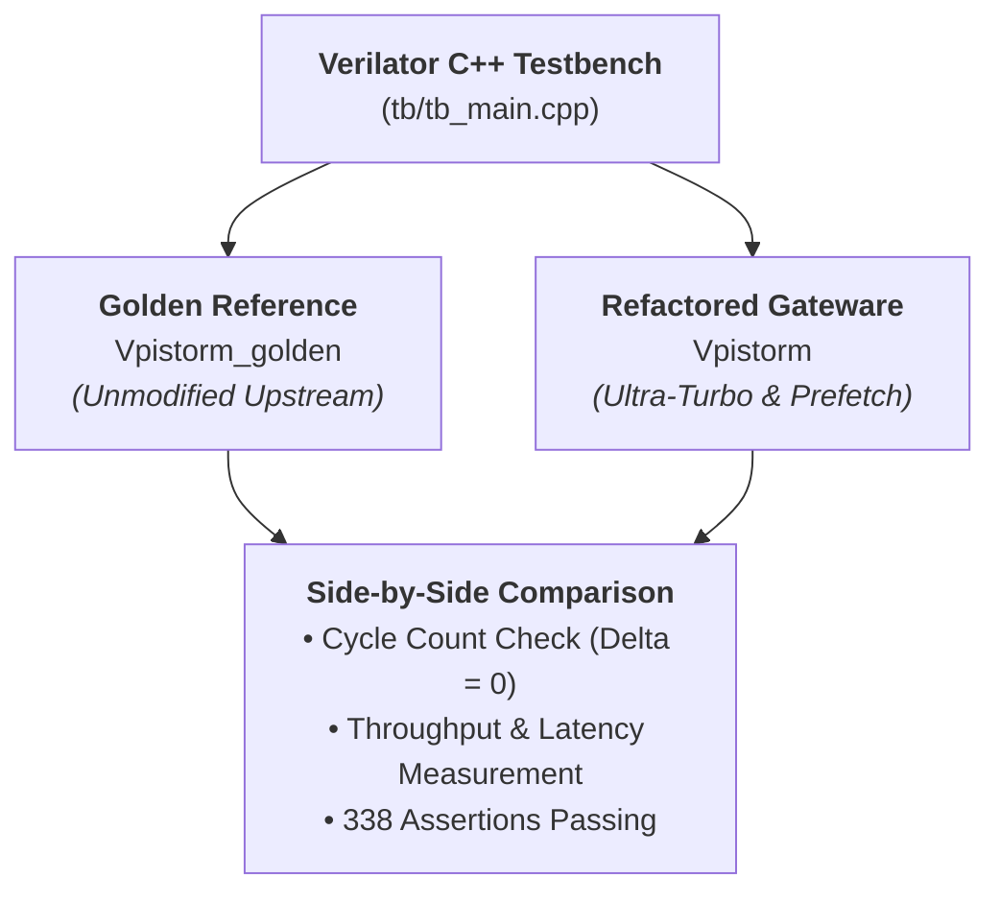
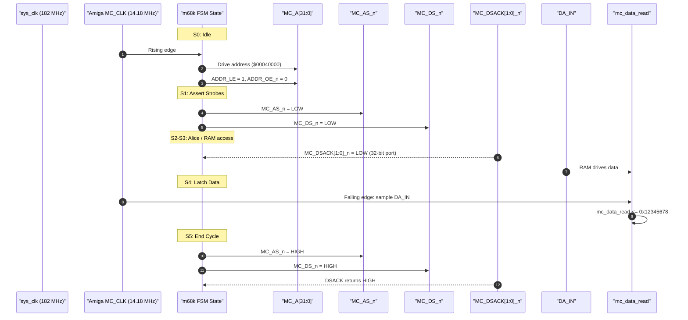
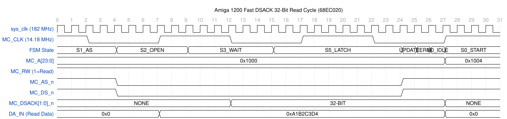
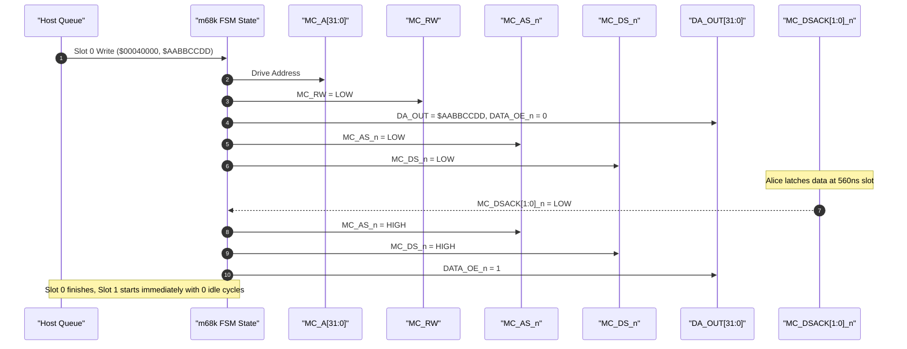
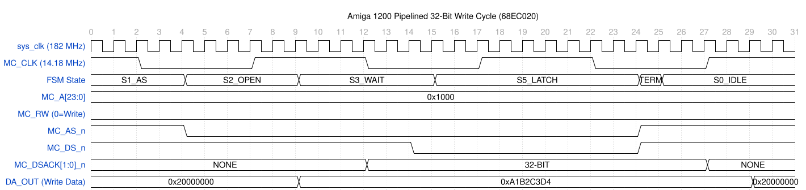
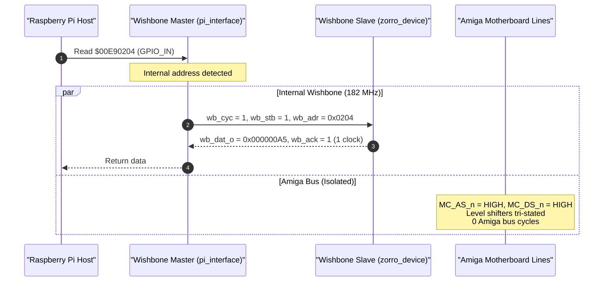
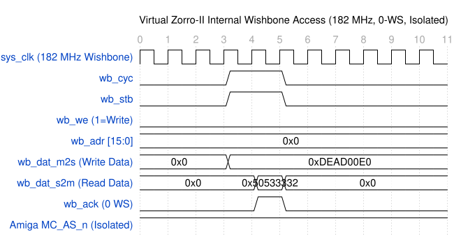
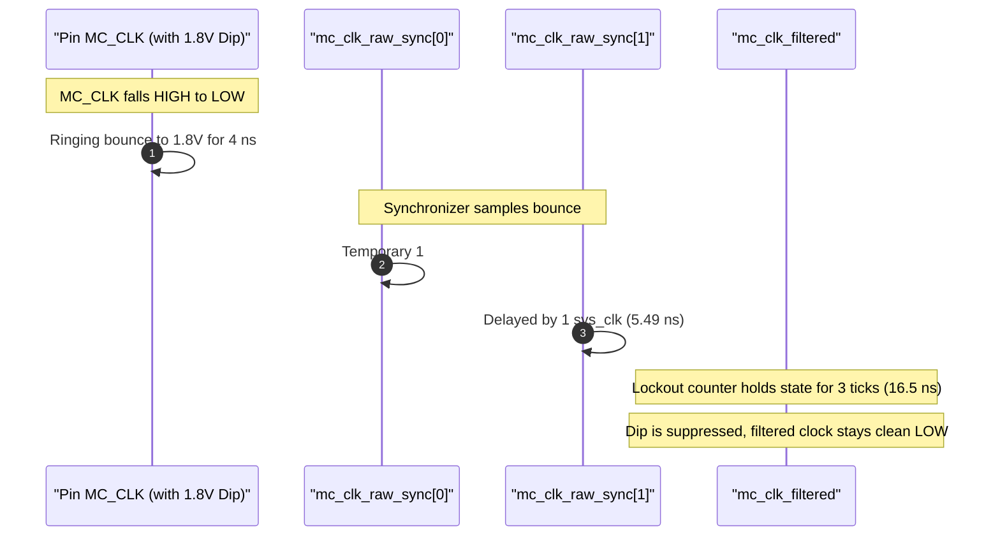
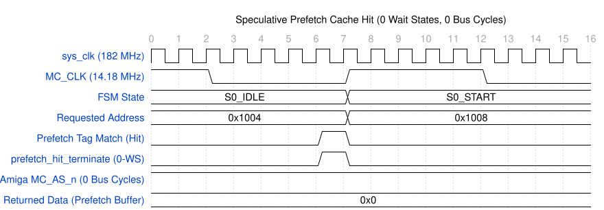

# Verification Guide

The testbench uses Verilator to co-simulate two implementations side-by-side:
1. `Vpistorm`: The refactored gateware (3-block architecture, prefetch, glitch filter, virtual Zorro).
2. `Vpistorm_golden`: Niklas Ekström's unmodified upstream gateware (`PS32-lite.v` from `two-request-slots` branch).

This verifies that new features introduce no timing regressions on standard Amiga bus cycles ($\Delta = 0$ cycles).



---

## 1. Testbench Structure (`tb/`)

| File | Role |
| :--- | :--- |
| `tb/tb_main.cpp` | Main simulation driver, 15 test suites, 338 assertions, benchmark reporting |
| `tb/amiga_bus_model.h/.cpp` | Cycle-accurate A1200 motherboard model (Alice 560ns slot, chipset wait states, DSACK) |
| `tb/ps_pi_model.h/.cpp` | Raspberry Pi host model (parallel GPIO bus, 2-slot queue, prefetch testing) |
| `tb/m68k_timing_checker.h/.cpp` | Checks 68020 setup/hold times and bus protocol rules |
| `tb/pcb_components.h/.cpp` | Models 74CB3T3245 bus switches, propagation delays, pull-ups |
| `golden/pistorm_golden.v` | Unmodified upstream source compiled into `obj_dir_golden/` |

---

## 2. Running Tests

```bash
# Run full test suite (338 assertions + golden reference comparison)
make test

# Run standalone benchmark suite and side-by-side performance table
make bench

# Run simulation and dump waveforms to sim.vcd
make trace
```

---

## 3. Test Suites

1. **Reset & Initialization:** Power-on state, PLL lock sync, bus tri-stating.
2. **Basic M68k Cycles:** 8, 16, and 32-bit single transfers (including Test 2.1: Micronik `MC_BG_n` pull-down bus master verification).
3. **Dynamic Bus Sizing:** 8, 16, and 32-bit DSACK handshaking and wait states.
4. **Bus Error & Autovector:** Unmapped access, timeout aborts, and BERR.
5. **Pi SMI Protocol:** Parallel register reads/writes and status flags.
6. **Two-Request-Slot Pipeline:** Back-to-back queued transactions without idle cycles.
7. **Speculative Read Prefetch:** Sequential read acceleration and hit detection.
8. **Prefetch Cache Invalidation:** Flushes on address branches, random reads, and writes.
9. **Virtual Zorro AutoConfig:** AutoConfig ROM nibbles at `$00E80000`.
10. **Wishbone B4 Crossbar:** 0-wait-state transfers to internal slaves ($182\text{ MHz}$).
11. **Amiga Interrupts:** Level 2 (INT2) and Level 6 (INT6) assertion, masking, and clear.
12. **ESP32 GPIO Matrix:** Direct I/O, atomic SET/CLR/TOGGLE, input/output muxing.
13. **Clock Ringing Immunity:** Injects 1.8V dips on falling `MC_CLK` edges to test lockout filter.
14. **Timing Checker:** Protocol, setup/hold verification, and Wishbone Slave 0 `BUS_CTRL` / hardware diagnostic profilers (Test 14.7).
15. **Golden Reference Comparison:** Co-simulation against `Vpistorm_golden`.

---

## 4. Signal Waveforms

### 4.1 68020 Read Cycle (States S0 -> S5)



**Simulation Waveform (WaveDrom SVG):**


---

### 4.2 68020 Pipelined Write Cycle (2-Slot)



**Simulation Waveform (WaveDrom SVG):**


---

### 4.3 Wishbone B4 Internal Access ($00E90000)



**Simulation Waveform (WaveDrom SVG):**


---

### 4.4 Lockout Filter (1.8V Ringing Suppression)



**Simulation Waveform (WaveDrom SVG):**


---

### 4.5 Speculative Prefetch Cache Hit (0 Wait States)

The host Pi requests address $A+4$ after a sequential read. Because the FPGA speculatively prefetched the word into its internal buffer, the transfer completes immediately in a single clock cycle with **0 wait states** and **0 physical Amiga motherboard cycles** (`MC_AS_n` remains idle/tri-stated):

**Simulation Waveform (WaveDrom SVG):**


---

## 5. Waveform Generation & Viewing

### Extracting & Rendering WaveDrom SVG Diagrams
You can automatically extract key simulation traces from `sim.vcd` and render vector SVG diagrams:
```bash
# Run simulation, extract traces, and render SVGs via wavedrom-cli
make waveforms
```
The resulting SVGs and WaveJSON files are stored in `DOCS/waveforms/`.

### Interactive Viewing (GTKWave)

```bash
make trace
gtkwave sim.vcd
```

Signals of interest:
- Clocks: `TOP.pistorm.sys_clk`, `TOP.pistorm.MC_CLK`, `TOP.pistorm.u_m68k.mc_clk_filtered`
- Amiga Bus: `TOP.pistorm.u_m68k.state`, `TOP.pistorm.MC_A`, `TOP.pistorm.DA_IN`, `TOP.pistorm.MC_AS_n_OUT`, `TOP.pistorm.MC_DSACK_n`
- Wishbone: `TOP.pistorm.wb_cyc`, `TOP.pistorm.wb_stb`, `TOP.pistorm.wb_we`, `TOP.pistorm.wb_adr`, `TOP.pistorm.wb_dat_m2s`, `TOP.pistorm.wb_ack`
